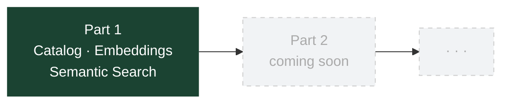

# Aiven semantic search (tutorial series)

This repo is a **multi-part** walkthrough. Each part lives in its own directory so dependencies, commands, and blog posts can stay in sync.

## Current part

- **[Part 1](part-1/README.md)** - Handmade fishing lure catalog, **Aiven for OpenSearch**, **Vertex AI (Gemini) embeddings**, semantic search and cost estimates.



## Quick start

```bash
cd part-1
python3 -m venv .venv
source .venv/bin/activate
python3 -m pip install -r requirements.txt
python3 -m pip install -e .
cp .env.example .env
# Edit .env with your Aiven service URI, GCP project, and optional OPENSEARCH_INDEX (default: lures)
set -a && source .env && set +a
gcloud auth application-default login
```

Full steps, reset-index, and doc links: see [part-1/README.md](part-1/README.md).

## Security

Do not commit credentials. See [SECURITY.md](SECURITY.md).
