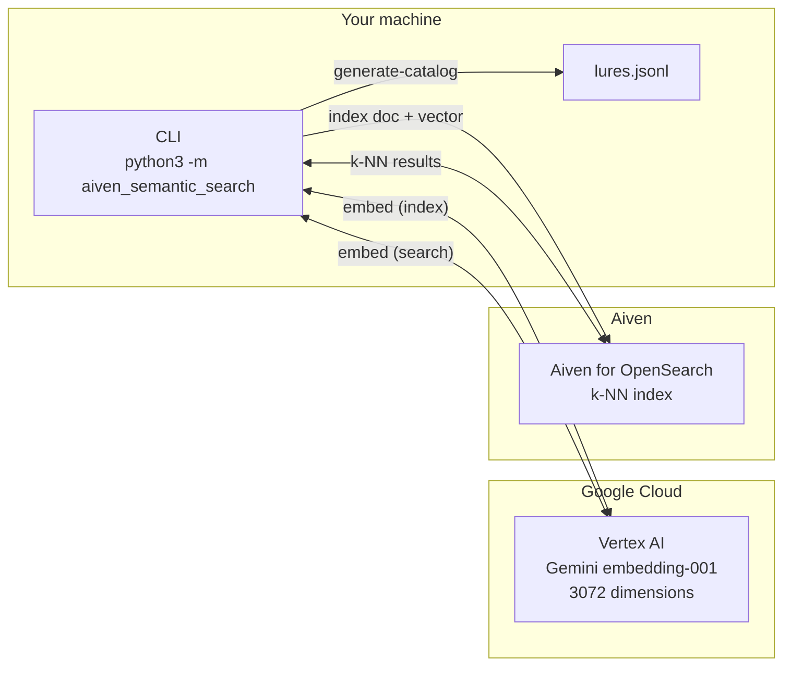
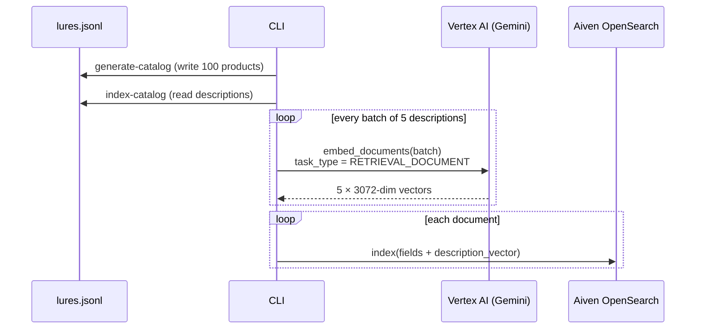
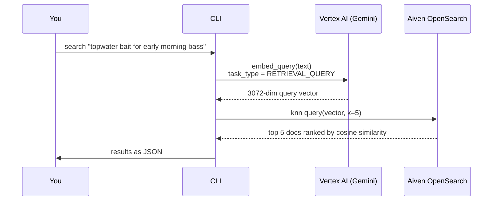

## Part 1 - Semantic search for handmade fishing lures

This part builds a small, reproducible semantic search demo:

- **Catalog**: 100 small-batch, handmade fishing lures (generated deterministically)
- **Embeddings**: Gemini embeddings via **Vertex AI**
- **Vector search**: Aiven for OpenSearch (`knn_vector` + k-NN query)

The goal of Part 1 is to be extremely clear and reproducible. Later parts in the series will build on this foundation (recommendations, hybrid search, and beyond).

Do not commit secrets. See [../SECURITY.md](../SECURITY.md).

## Architecture

Three services collaborate in this demo. The CLI on your machine orchestrates everything; Vertex AI provides the embedding model; Aiven for OpenSearch stores and searches the vectors.



## Prerequisites

- **Python 3.10+**
- **An Aiven for OpenSearch service**
- **A Google Cloud project with Vertex AI enabled**
- **Local Google auth** (Application Default Credentials)

## Setup

From the `part-1/` folder:

```bash
python3 -m venv .venv
source .venv/bin/activate
python3 -m pip install -r requirements.txt
python3 -m pip install -e .
```

## Configure environment variables

```bash
cp .env.example .env
set -a && source .env && set +a
```

Set **`OPENSEARCH_URI`**, **`GCP_PROJECT_ID`**, and optionally **`OPENSEARCH_INDEX`** (default in code: `lures`). Use one index name consistently; if you previously used `products`, either point `OPENSEARCH_INDEX` at that index or run `reset-index --force` after switching to avoid mixing schemas.

## Authenticate to Google Cloud (Vertex AI)

```bash
gcloud auth application-default login
```

## How the pipelines work

There are two distinct data flows. Understanding them before running the commands makes the output easier to interpret.

**Indexing** - run once to build the searchable vector index:



**Searching** - run as many times as you like once the index is built:



> The same embedding model is used on both sides. That is intentional - document and query vectors must live in the same embedding space for the distance calculation to be meaningful.

## Run the demo

### (Optional) Start over from scratch (delete the index)

If you want to wipe all documents + vectors and restart the tutorial:

```bash
python3 -m aiven_semantic_search reset-index --force
```

### 1) Create the vector index in OpenSearch

```bash
python3 -m aiven_semantic_search create-index
```

### 2) Generate the lure catalog (100 products)

```bash
python3 -m aiven_semantic_search generate-catalog --out data/lures.jsonl --count 100 --seed 42
```

### 3) Estimate the cost before you index (optional but recommended)

```bash
python3 -m aiven_semantic_search estimate-embedding-cost data/lures.jsonl
```

This reads the catalog locally (no API call required) and prints a projected cost based on description length. For a 100-product catalog the cost is typically a fraction of a cent.

### 4) Index the catalog (embed + upsert)

```bash
python3 -m aiven_semantic_search index-catalog data/lures.jsonl --batch-size 5 --refresh
```

### 5) Run semantic searches

```bash
python3 -m aiven_semantic_search search "small jerkbait for clear water trout" --k 5
python3 -m aiven_semantic_search search "weedless soft plastic for bass in heavy cover" --k 5
python3 -m aiven_semantic_search search "topwater bait for early morning on a calm lake" --k 5
```

## Cost transparency (embeddings)

This demo's main variable cost is **Vertex AI embeddings**.

Vertex AI charges by **input tokens**, not per document or per request. Use the `estimate-embedding-cost` command to get the exact token count before you index:

```bash
python3 -m aiven_semantic_search estimate-embedding-cost data/lures.jsonl
```

Example output:

```json
{
  "documents": 100,
  "total_description_chars": 13028,
  "approx_input_tokens": 3257,
  "pricing_usd_per_1k_tokens": 0.00015,
  "approx_embedding_cost_usd": 0.000489,
  "note": "Token count uses 1 token ~= 4 chars (approximation - countTokens is not supported for embedding models). See https://cloud.google.com/vertex-ai/generative-ai/pricing for current rates."
}
```

**Why approximation?** The Vertex AI `countTokens` API only works with generative models (e.g. `gemini-2.0-flash`). Embedding models like `gemini-embedding-001` return an error when you call it against them - Google does not expose a token-counting endpoint for embedding models. The `1 token ~= 4 characters` approximation is directionally accurate for English prose; for short product descriptions the error is typically a few percent in either direction.

The formula:

\( \text{cost} \approx \frac{\text{approx\_input\_tokens}}{1000} \times 0.00015 \) USD

Always verify the current rate at [cloud.google.com/vertex-ai/generative-ai/pricing](https://cloud.google.com/vertex-ai/generative-ai/pricing) before making budget decisions.

## References (source of truth)

- **Aiven**
  - Connect to Aiven for OpenSearch with Python: `https://developer.aiven.io/docs/products/opensearch/howto/connect-with-python.md`
  - TLS/SSL certificates (project CA vs public CA): `https://aiven.io/docs/platform/concepts/tls-ssl-certificates`
- **OpenSearch (vector search)**
  - k-NN index: `https://docs.opensearch.org/2.14/search-plugins/knn/knn-index`
  - `knn_vector` field type: `https://docs.opensearch.org/2.17/field-types/supported-field-types/knn-vector/`
- **Google Cloud / Vertex AI**
  - Enable Vertex AI API: `https://cloud.google.com/vertex-ai/docs/start/cloud-environment`
  - Get text embeddings: `https://docs.cloud.google.com/vertex-ai/generative-ai/docs/embeddings/get-text-embeddings`
  - Text embeddings model reference: `https://docs.cloud.google.com/vertex-ai/generative-ai/docs/model-reference/text-embeddings-api`
  - ADC overview: `https://docs.cloud.google.com/docs/authentication/application-default-credentials`
  - `gcloud auth application-default login`: `https://docs.cloud.google.com/sdk/gcloud/reference/auth/application-default/login`

